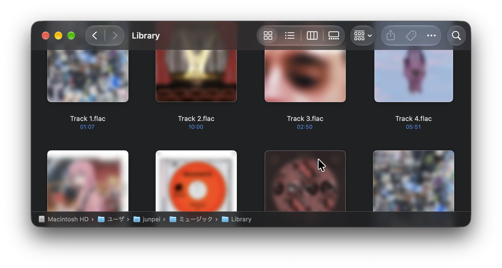
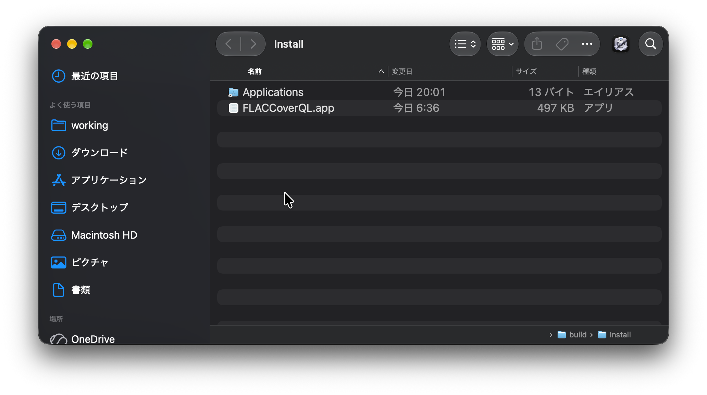

# FLACCoverQL

- [English](#flaccoverql-english)

FLACのアイコンをmacOSで表示できるようにするQuick Look拡張です。



## 必要環境
- macOS 14.0 以上
- Xcode Command Line Tools

```sh
xcode-select --install
```

## ビルドとインストール

Gatekeeper の制約のため、インストール方法はソースからのビルドのみとしています。ビルドしたアプリケーションには ad-hoc 署名が施されます。

```sh
make install
```



`FLACCoverQL.app` を `/Applications` ディレクトリにドラッグ＆ドロップして配置したあと、起動してください。

## セットアップと動作確認
1. アプリケーション内の「機能拡張の設定」をクリックして macOS のシステム設定を開き、「クイックルック」一覧から `FLACCoverQLThumbnail` を有効にします。
2. アプリケーション内の「動作状態を再確認」をクリックし、「動作しています」と表示されることを確認します。
3. すでに読み込まれている Finder のサムネイルが更新されない場合は、アプリ内の「キャッシュを消去」をクリックします。

アプリケーションは設定と動作確認のためのものです。⌘Q で終了しても、サムネイル表示は引き続き機能します。

## ライセンス
[LICENSE](LICENSE)

---

# FLACCoverQL (English)

An application that enables embedded FLAC cover art to be displayed in Finder thumbnails.


## Requirements
- macOS 14.0 or later
- Xcode Command Line Tools

```sh
xcode-select --install
```

## Build and Installation

Due to Gatekeeper restrictions, installation is only supported by building from source. The built application is ad-hoc signed.

```sh
make install
```


Drag and drop `FLACCoverQL.app` into your `/Applications` directory, then launch it.

## Setup and Verification
1. Click "Extension Settings" in the app to open the macOS System Settings, then enable `FLACCoverQLThumbnail` under the "Quick Look" extensions.
2. Click "Recheck Extension Status" in the app and verify that it displays "Extension is working".
3. If existing Finder thumbnails do not update, click "Clear Thumbnail Cache" in the app.

The application is only used for setup and verification. Thumbnails continue to work after you quit it with ⌘Q.

## License
[LICENSE](LICENSE)
